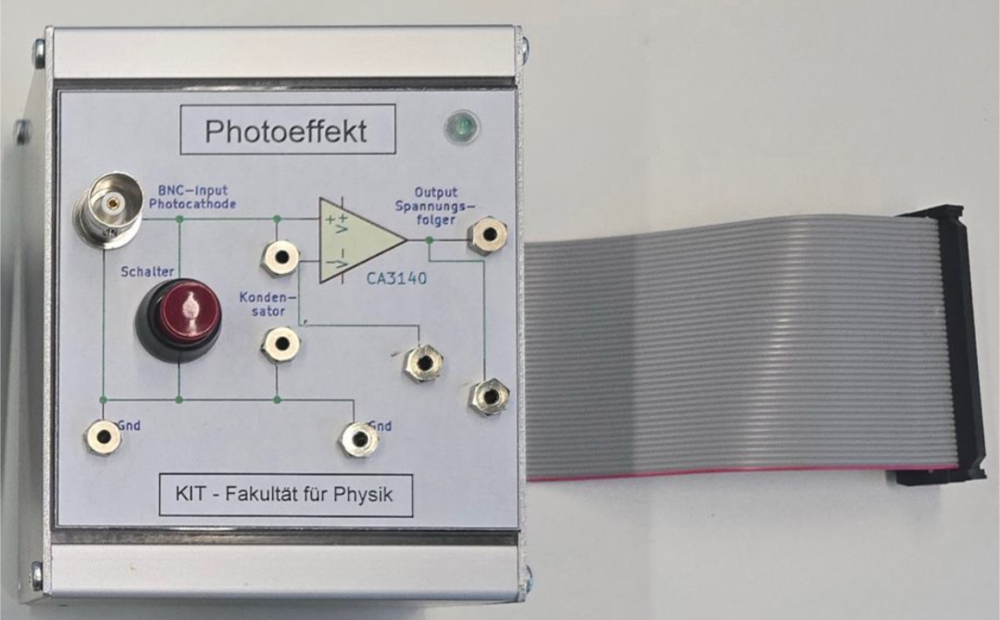

# Instructions for building an Impedance converter for the Raspberry Pi

## Summary 

This project provides instructions for building an Impedance converter for the Raspberry Pi (a single-board computer), as used in physics labs for students at the Faculty of Physics at the Karlsruhe Institute of Technology.

*Abb. 1*: Illustration of the impedance converter with measuring case used in the “photoelectric effect”-lab experiment.  
                    

The framework for this is based on the [PhyPiDAQ](https://github.com/PhyPiDAQ) project by Prof. Dr. Günter Quast, which aims to provide students access to state-of-the-art measurement technology and data
acquisition tools.

In the physics lab at KIT, the charging curve of a capacitor is measured and digitized, whereby the capacitor is charged by the photocurrent of a photocell.
The voltage difference across the capacitor can thereby be passed on to the ADC via the high-impedance input and low-impedance output of the operational amplifier without discharging the capacitor.
#### Currently available Documentation

- [Build instructions for circuit board](docs/Hardware_instructions.md)
- [Software instructions for Data acquisition](docs/Software_instructions.md)
