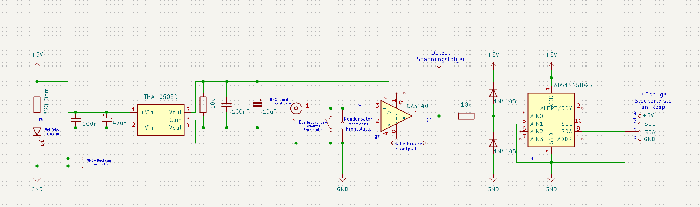
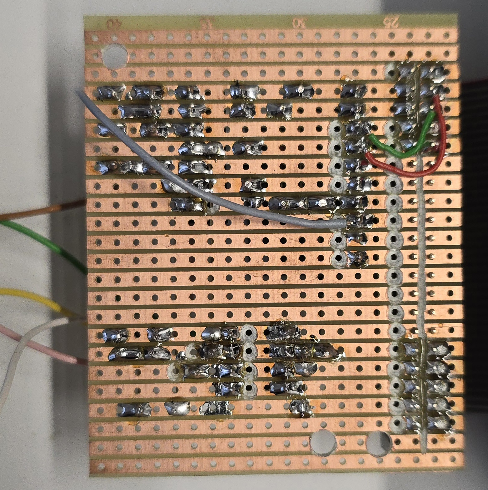
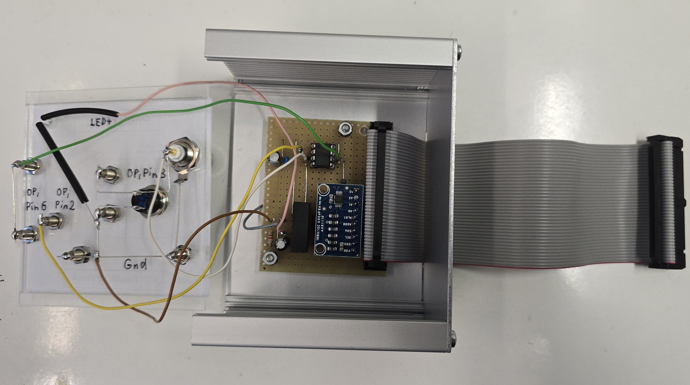
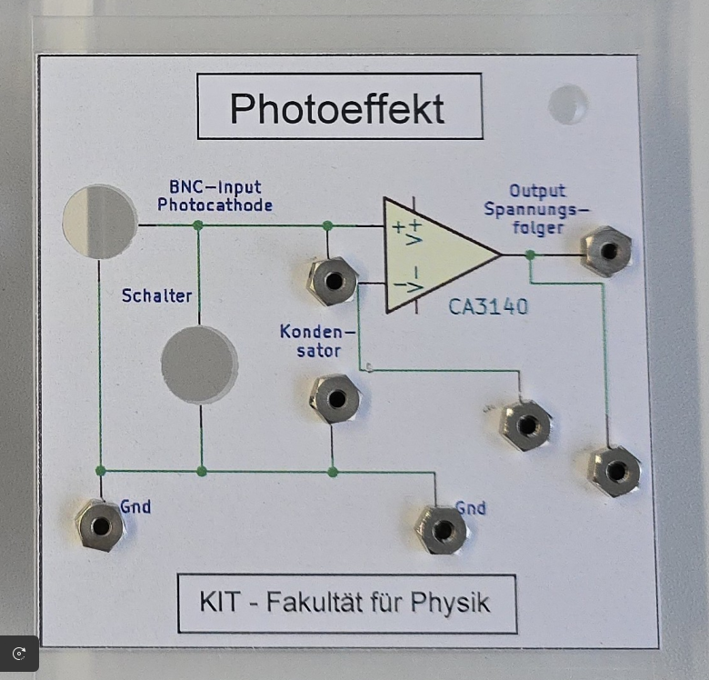

# Build instructions for building an Impedance converter for the Raspberry Pi
The circuit board described below is based in part on that of the PhyPiDAQ-project's portbale [Measuring case](https://github.com/PhyPiDAQ/MeasuringCase).

*Fig. 1*: Circuit diagram of the impedance converter.  
                    

A list of the electrical components and part numbers is available at [components](/docs/components).

The power supply for the measurement box is provided via the 5V pinout of the Raspberry Pi.
The 5. generation of RasPi's are used in the physics labs at the Faculty of Physics at KIT. To run the [PhyPiDAQ](https://github.com/PhyPiDAQ) software, it is recommended to use a RasPi from the 3. generation onwards.

A CA3140 chip is used as an operational amplifier under the use of a voltage follower / impedance converter, which receives a symmetrical supply voltage of 5V from a TMA-0505D. The preceding capacitors and resistors are used to stabilize the voltage.
An ADS1115 is used to digitize the signal, which can digitize voltages up to 5V through the preceeding protection diodes. The RasPi is connected by a 40 Pin ribbon cable to the strip board (As can be seen in Fig. 1 it is also possible to use a smaller cable, since just 4 GPIO Pins are necessary).

**Important : To stabilize the charging curve and filter out periodic, long-wave noise signals, a differential measurement is performed between inputs A1 and A0 of the ADS1115. A0 is connected to the output of the CA3140 and A1 to the Common Ground.**

*Fig. 2*: Model of soldered connections on a strip board.  
                    

The components used are soldered onto a strip board and connected to each other using the shortest possible cable connections.

The following figures show the actual solder and cable connections. The connections to the inputs and outputs on the case cover are also shown.

*Fig. 3*: Backside of the strip board with soldered connections.  
                    

*Fig. 4*: Front of the strip board with with wired connections to the Inputs and Outputs of the case cover.  
                    

For the BNC input, the push button, and the 2 mm sockets, suitable holes must be drilled into the front panel of the case in order to mount them.
Finally, a [shortened circuit diagram](images/Front_cover.jpg) is attached to the front of the case.

*Fig. 5*: Front of the strip board with with wired connections to the Inputs and Outputs of the case cover.  
                    

To reduce noise during charge-sensitive measurements, it is advisable to use plug-in capacitors, connection cables that are as short as possible and no open connections to the work surface.