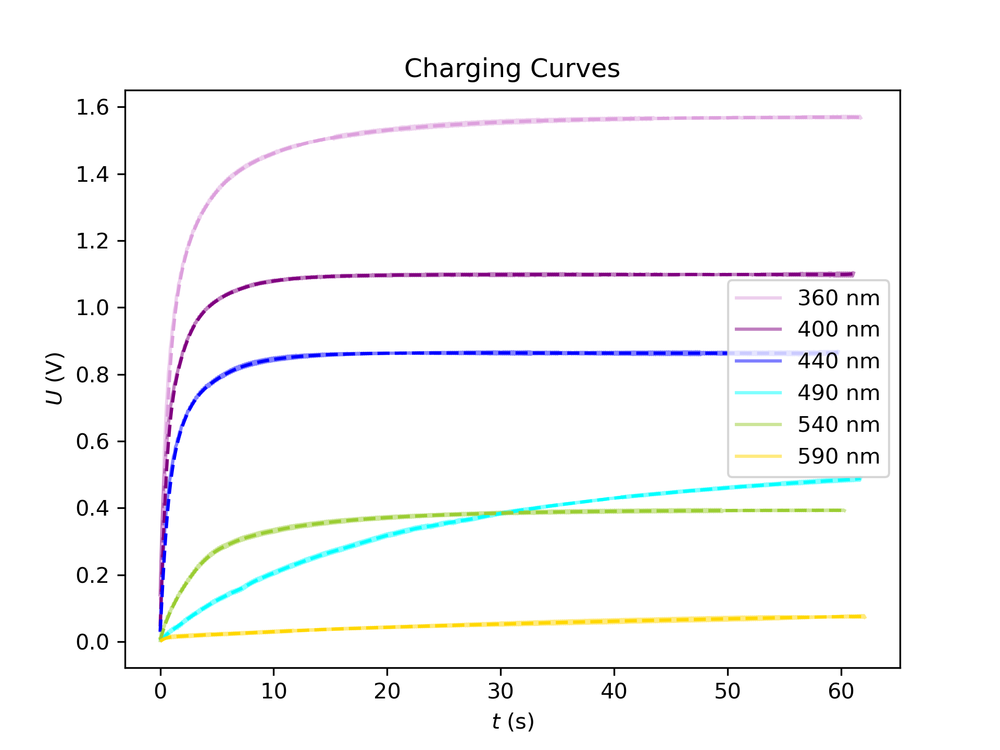
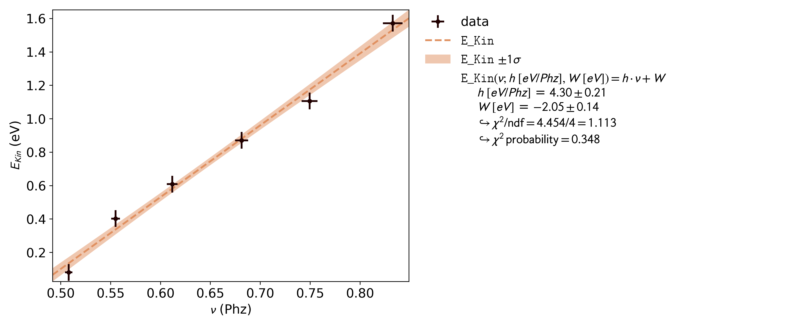
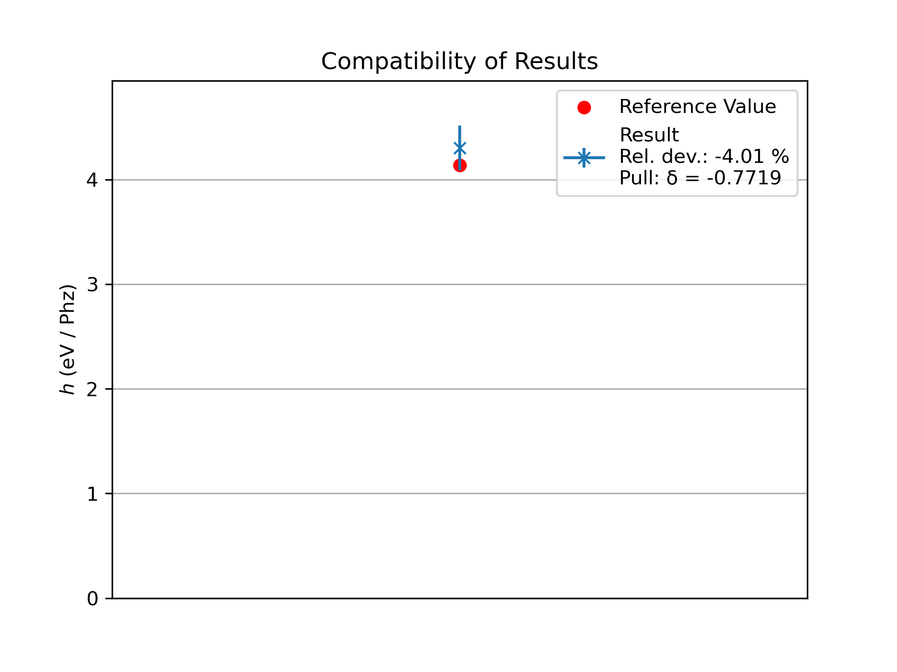

# Software instructions for Data acquisition

The readout software is the [PhyPiDAQ](https://github.com/PhyPiDAQ) software developed under the direction of Prof. Dr. Guenter Quast for the readout, visualization, and analysis of measurement data from a wide variety of sensors for the Raspberry Pi.

Instructions for installing and getting started with the software can be found at [Installation](https://github.com/PhyPiDAQ/PhyPiDAQ), [Software Description](https://github.com/PhyPiDAQ/PhyPiDAQ/blob/main/docs/Documentation_en.md) and for beginners especially at [Educators Guide](https://github.com/PhyPiDAQ/EducatorsGuide/blob/main/EducatorsGuide.md).
The photoelectric effect experiment is also described in the [PhyPiDAQ](https://github.com/PhyPiDAQ/EducatorsGuide/blob/main/experiments/photoeffect.md) GitHub repository.

In addition to the measuring box and the external setup consisting of the optical setup of the lenses and filters, the photocell and the Hg-lamp, only a capacitor with a size of 1 to 10 nF is required to run the experiment.

To start a series of measurements, all you need to do is adjust the configuration files of the PhypIDAQ software, as shown in the following two code examples, which can be copied.

*photoeffekt.daq:*
```yaml
DeviceFile: config/photoeffekt_ADS1115Config.yaml   # 16 bit ADC, I2C bus
ChanLabels: ['Voltage']            # names for channels 
ChanUnits: ['V']         # units for channels 
ChanColors: [darkblue]      # channel colours in display

Interval: 0.05                 # logging interval  
NHistoryPoints: 20000          # number of points used in history buffer, time=NHistoryPoints*Interval = 2000*0.05 = 100 seconds
DisplayModule: DataGraphs     # text, bar-graph, history and xy-view
Title: "Data from File"       # display title
DataFile:   null              #  null to disable 
CSVseparator: '   '            # field separator, set to ';' for German Excel   
```

*photoeffekt_ADS1115Config.yaml:*
```yaml
DAQModule: ADS1115Config  
ADCChannels: [0]
DifModeChan: [true] # differntial measurement of channel 0 minus 1
Gain: [1]
sampleRate: 860 #max. sample rate
```
Now the measurement can bes started and the charging curve of the capacitor can be displayed and saved as a .csv file.
The results of the measurement series with different wavelengths due to the interference filter can be visualized for example with python via matplotlib, as shown below.

*Fig. 1*: Charging curves of 4.7 nF capacitor for different wave lengths  
                    

**Photon energy**  
Light of wavelength $\lambda$ has frequency  
$$
\nu = \frac{c}{\lambda}
$$
and therefore energy  
$$
E_{\text{light}} = h\,\nu.
$$

---

**Kinetic energy of photoelectrons**  
After overcoming the work function $E_{A}$, the maximum kinetic energy is  
$$
E_{\text{kin}} = E_{\text{light}} - E_{A} = h\,\nu - E_{A}.
$$

---

**Stopping potential and field energy**  
To stop the electrons, a reverse voltage $U$ is applied. The electric field energy stored per electron is  
$$
E_{\text{field}} = e\,U.
$$

---

**Steady-state (stopping) condition**  
Equating kinetic and field energy gives  
$$
e\,U = h\,\nu - E_{A}
\quad\Longrightarrow\quad
U = \frac{h}{e}\,\nu \;-\;\frac{E_{A}}{e}.
$$

---

**Linear analysis**  
A plot of $U$ versus $\nu$ is a straight line with:  
- **Slope:** $\displaystyle \frac{h}{e}$  
- **Intercept:** $\displaystyle -\frac{E_{A}}{e}$  

Measuring the slope directly determines the fundamental ratio $h/e$.

The plot of  $U \cdot e$ versus $\nu$ for the measurement above is shown below.

*Fig. 2*:   $U$ versus $\nu$
                    

This yields a quite good result for the comparison of the experimental value of $h$ and the literature value, as can bee seen below.

*Fig. 2*: Comparison of experimental and literature value
                    